# XianYuPlus（闲鱼 Plus）


XianYuPlus 是一套面向个人卖家的私有化闲鱼运营助手。它把多账号、商品、订单、在线客服、AI 回复、卡券库存、自动发货和售后自动化集中在一个后台中，适合希望减少重复操作、同时保留人工控制权的卖家。

项目以 Docker 方式部署，业务数据保存在自己的设备和数据库中，可运行在飞牛 OS、Linux 服务器或安装了 Docker Desktop 的电脑上。

> XianYuPlus 与闲鱼平台无官方关联。使用者应自行遵守所在地法律法规、闲鱼平台规则及账号使用规范。

## 项目解决什么问题

当商品和账号逐渐增多，卖家通常需要反复切换账号处理咨询、确认订单、寻找卡密、发送内容、补发售后并核对评价。XianYuPlus 将这些环节串成一套可追踪的工作流：

1. 同步并集中查看多个闲鱼账号的商品和订单。
2. 通过在线客服统一处理买家会话，必要时人工接管。
3. 按商品配置关键词回复、AI 客服和安全议价策略。
4. 买家付款后，根据商品关联关系调用固定内容、本地卡密、图片或外部 API 发货。
5. 记录每次自动化执行结果，失败时进入异常待办并允许人工补发。
6. 发货完成后按需执行确认发货、求小红花和自动评价。

它不是无人监管的“挂机脚本”。涉及发货、议价、黑名单和人工接管的关键节点均保留开关、状态和日志，便于随时暂停与核查。

## 核心能力

| 模块 | 能力 |
| --- | --- |
| 多账号管理 | 管理多个闲鱼账号，查看登录、Cookie、WebSocket 连接及自动化风险状态 |
| 商品列表 | 汇总所有账号商品，查看标题、价格、状态和所属账号，独立配置每个商品的自动化策略 |
| 发布商品 | 读取闲鱼类目与动态属性，选择发布地点，上传图片并发布真实商品 |
| 商品素材库 | 保存标题、描述、图片、价格等商品素材，并按不同账号生成差异化描述后多账号发布 |
| 在线客服 | 集中查看会话和历史消息，显示双方头像，支持手动回复、人工接管、买家标签与黑名单 |
| 自动回复 | 支持多触发词关键词规则、商品专属 AI 提示词、固定资料和系统 AI 兜底 |
| AI 安全议价 | 每个商品独立开关，可配置底价、单轮让价、最大轮数和议价风格，并阻止越过底价 |
| 订单管理 | 同步订单和交易状态，查看商品、买家、自动化进度，并支持人工确认与补发 |
| 卡券管理 | 管理本地卡密、固定文字、图片和外部 API 卡券，支持商品关联、库存预警与发货模板 |
| 自动发货 | 付款后按商品与 SKU 配置发货，保留幂等记录，失败可重试且不会随意重复取卡 |
| 自动化中心 | 管理定时任务、商品擦亮、自动评价、求小红花及失败重试 |
| 风险保护 | 黑名单可同时阻止关键词、AI、自动发货和人工补发；人工接管期间暂停自动回复 |
| 运维审计 | 提供仪表盘、异常待办、操作日志、实时日志、系统检查、通知渠道和数据备份 |

## 界面预览

以下截图来自 XianYuPlus 实际运行页面。账号、UNB、订单号、买家、商品 ID、内网地址和密钥等信息均已做不可逆脱敏；界面会随版本继续优化。

<details open>
<summary><strong>账号、商品与发布</strong></summary>
<br>

| 多账号管理 | 商品详情 |
| --- | --- |
| 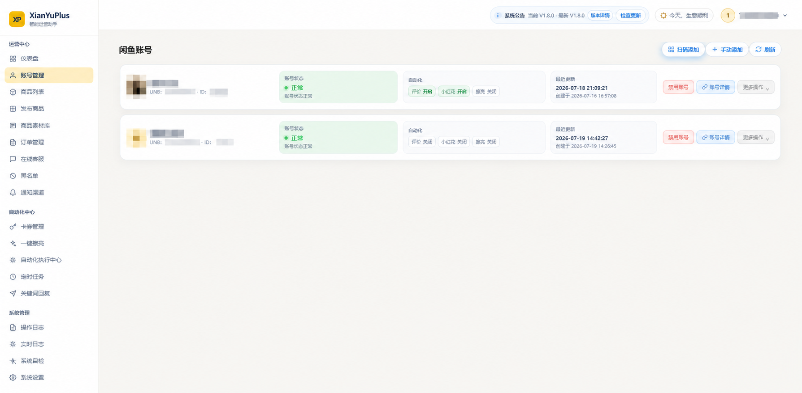 | 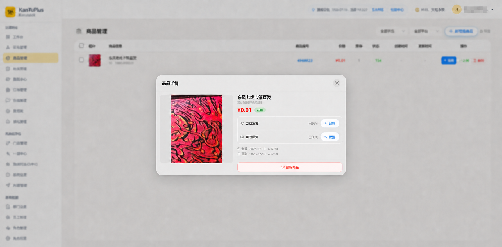 |

| 商品自动化配置 | 商品发布与 AI 文案 |
| --- | --- |
| 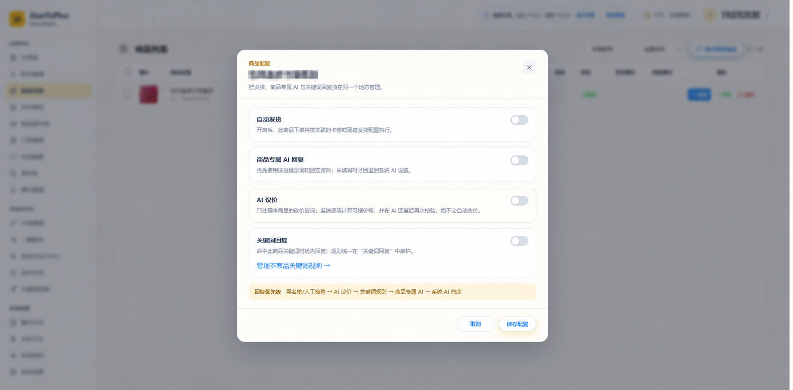 | 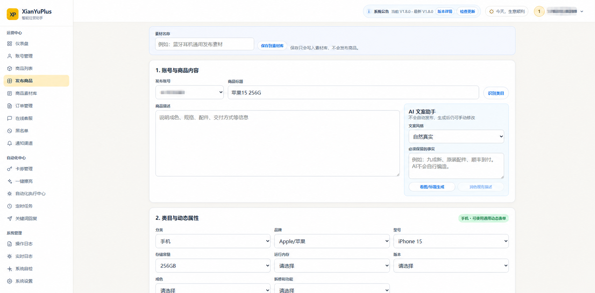 |

</details>

<details open>
<summary><strong>订单、客服与风控</strong></summary>
<br>

| 订单管理 | 在线客服 |
| --- | --- |
| 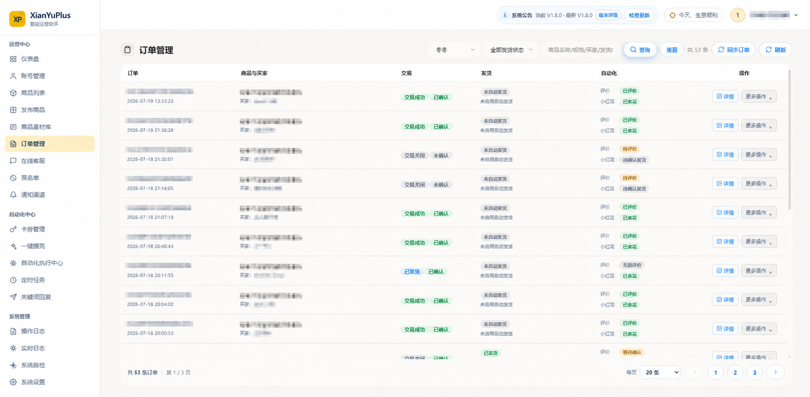 | 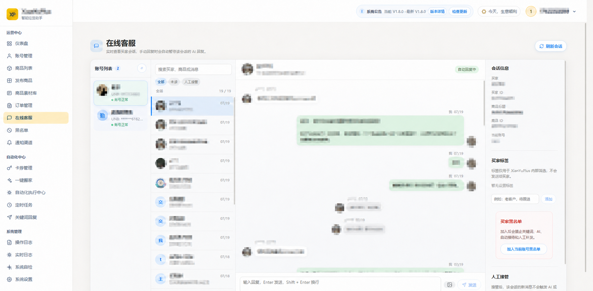 |

| 买家黑名单 | 通知渠道 |
| --- | --- |
| 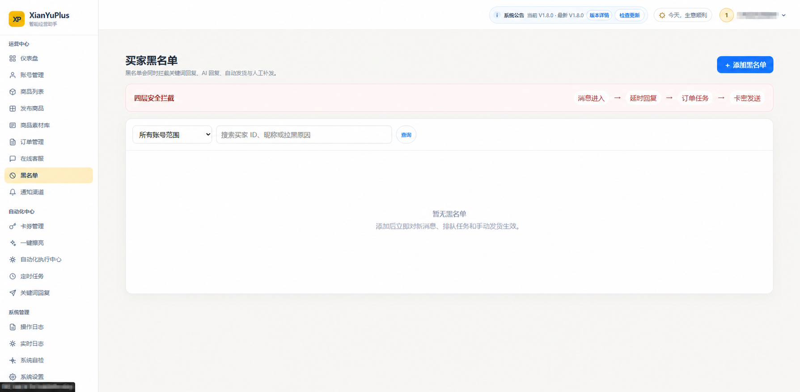 |  |

</details>

<details>
<summary><strong>卡券、库存与商品关联</strong></summary>
<br>

| 编辑卡券库 | 关联发货商品 |
| --- | --- |
| 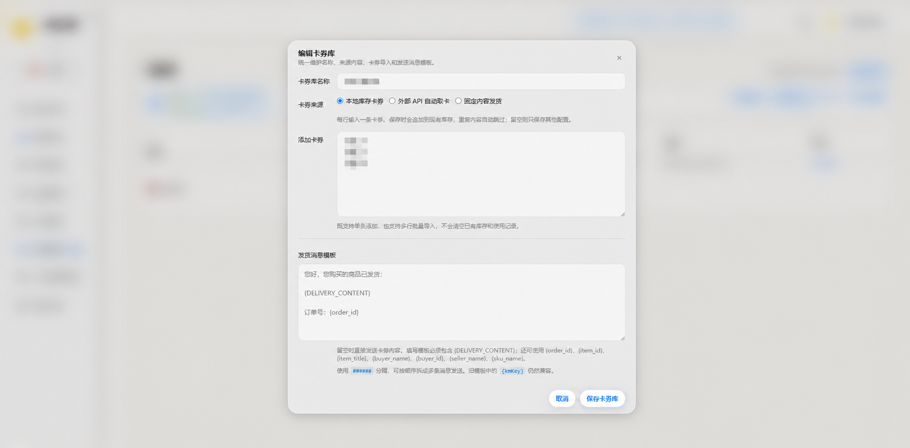 | 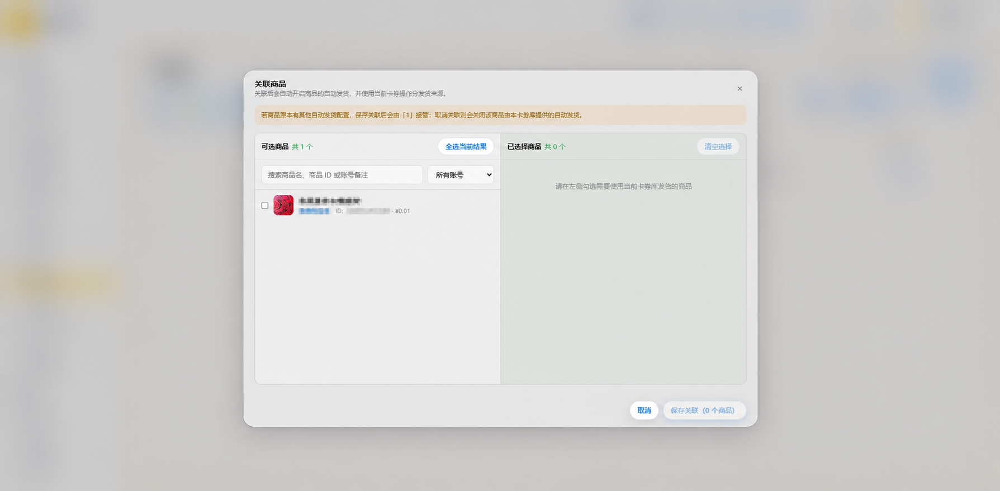 |

| 通知渠道状态 | 新建卡券库 |
| --- | --- |
| 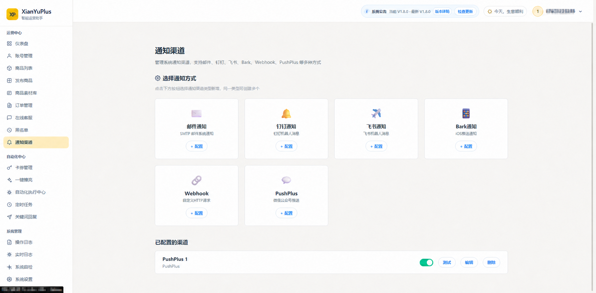 | 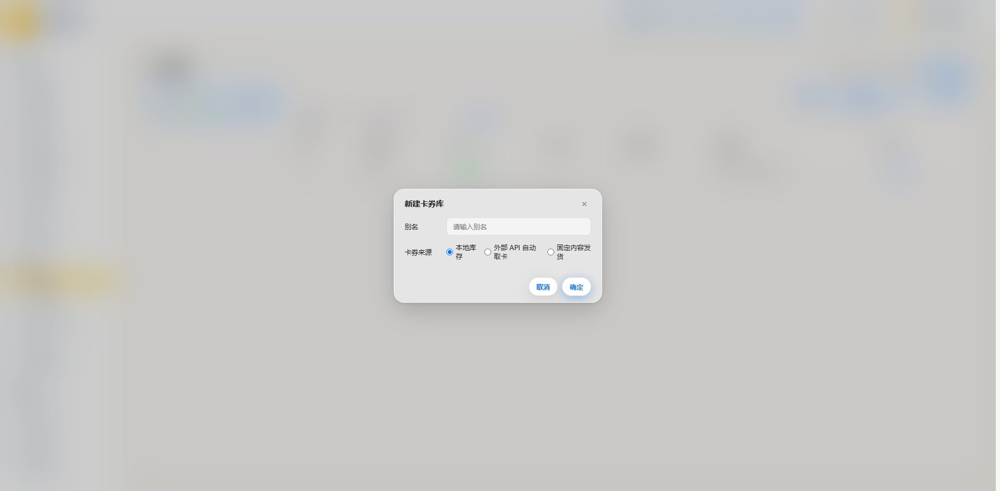 |

</details>

<details>
<summary><strong>自动化与回复策略</strong></summary>
<br>

| 一键擦亮 | 自动化执行中心 |
| --- | --- |
| 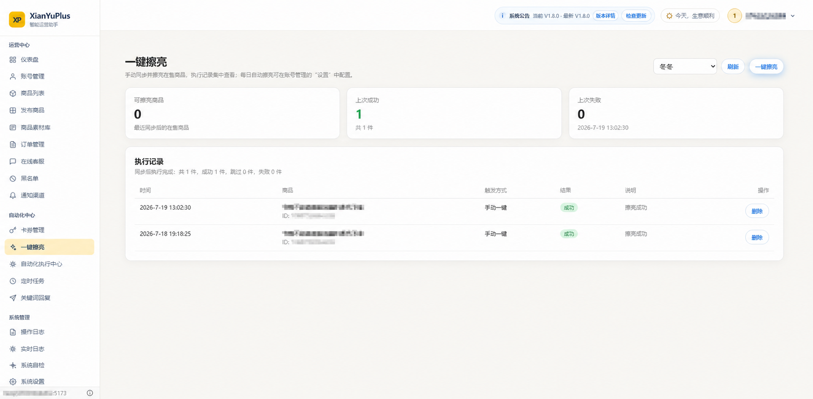 | 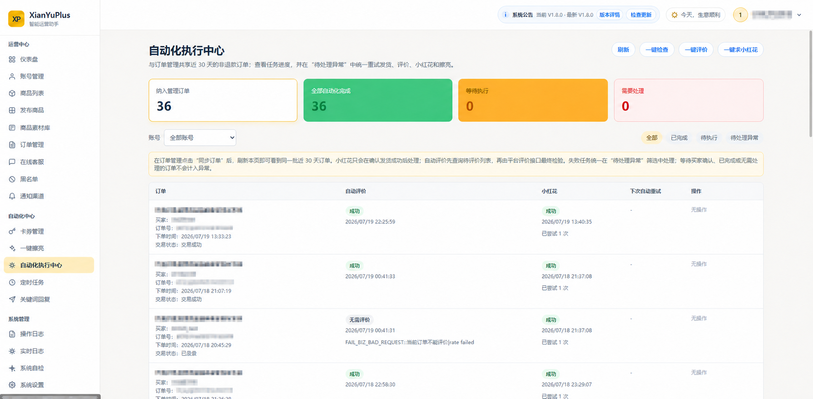 |

| 定时任务 | 关键词回复中心 |
| --- | --- |
| 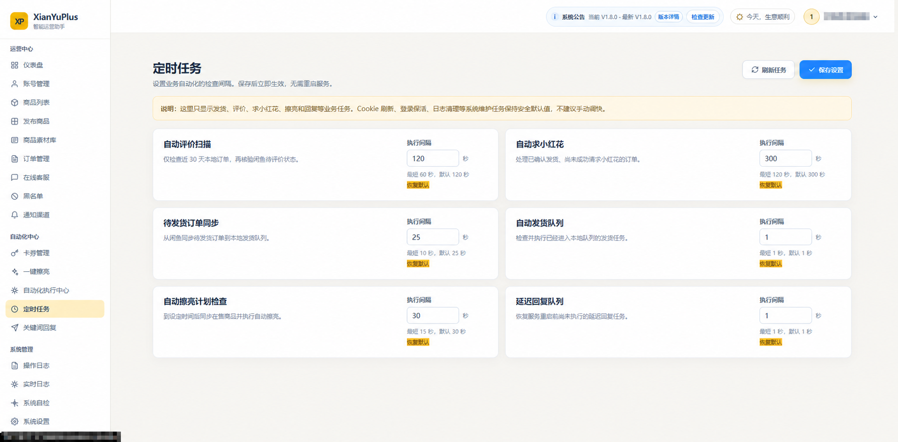 | 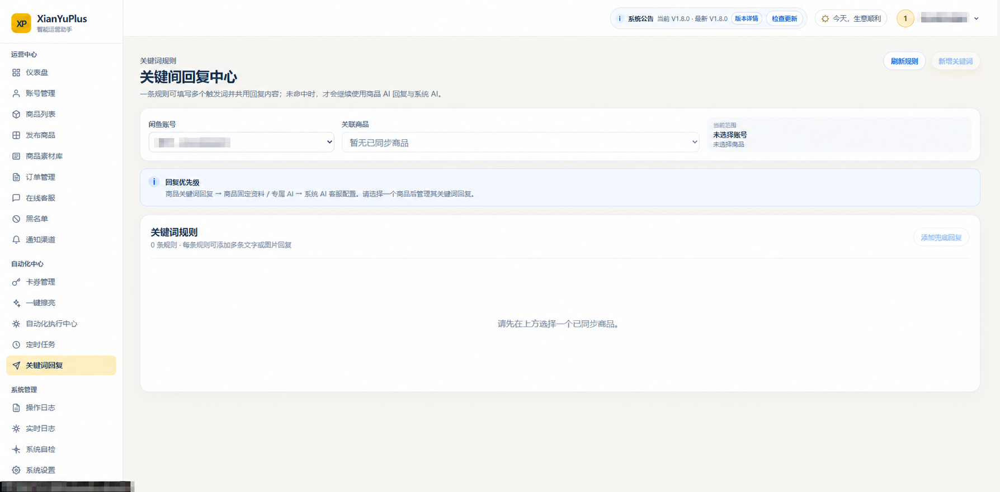 |

</details>

<details>
<summary><strong>日志、自检与系统设置</strong></summary>
<br>

| 操作记录 | 系统自检 |
| --- | --- |
| 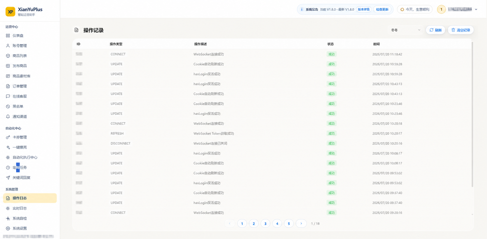 | 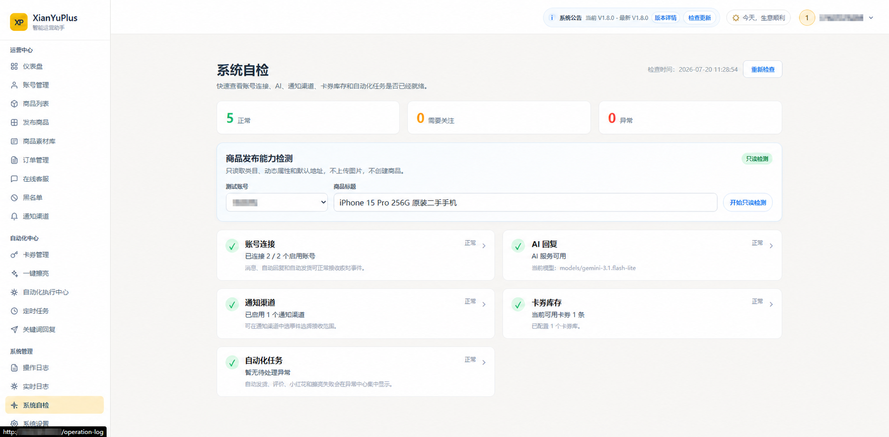 |

| AI 服务配置 | 备份与恢复 |
| --- | --- |
| 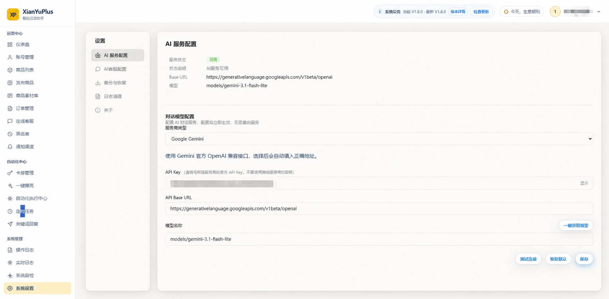 | 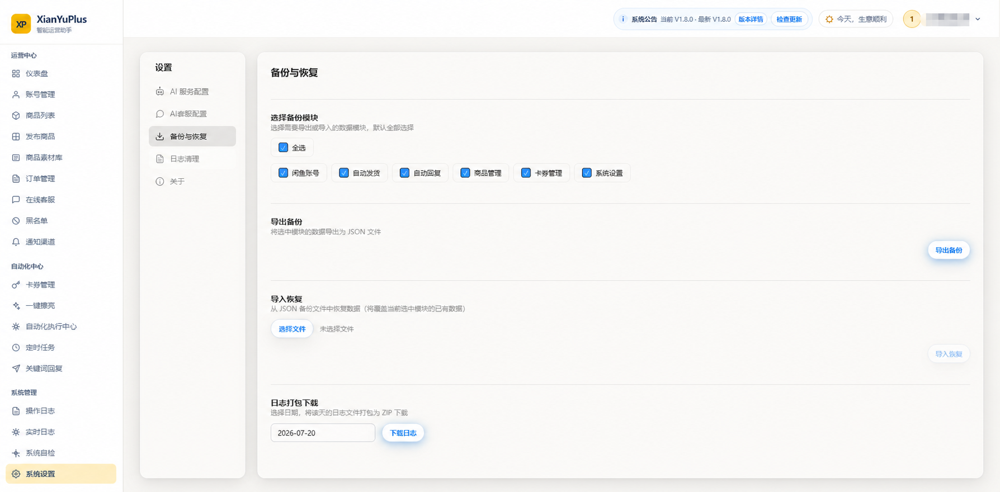 |

</details>

## 自动化优先级与保护

系统收到买家消息后，会先检查账号状态、买家黑名单、人工接管和商品开关，再决定是否回复。正常情况下，回复优先级为：

```text
黑名单 / 人工接管拦截
        ↓
商品关键词规则
        ↓
商品专属 AI（结合固定资料与议价配置）
        ↓
系统 AI 客服兜底
```

自动发货同样会在任务创建、排队和最终发送前重复校验黑名单、商品开关、订单状态与库存，降低旧任务在配置变化后继续执行的风险。

## 适合哪些使用场景

- 同时管理多个闲鱼账号，希望在一个后台查看商品、订单和消息。
- 销售卡券、兑换码、网盘资料、教程、图片或其他可数字化交付的商品。
- 需要通过供应商 API 实时取卡，并避免网络重试造成重复扣费。
- 希望使用 AI 处理常见咨询或议价，但需要商品级开关、底价和人工接管保护。
- 经常重复发布相似商品，希望沉淀素材并按多个账号生成不同描述。
- 希望将系统和业务数据部署在自己的 NAS 或服务器中。

实物商品也可以使用商品发布、商品同步、在线客服、订单管理和 AI 回复等功能；自动卡券发货主要面向可通过文字或图片完成交付的商品。

## 快速安装

### 飞牛 OS / Linux

确保设备已经安装 Docker Engine 和 Docker Compose v2，然后执行：

```bash
git clone https://github.com/najiuwanan/xianyu-Plus.git && cd xianyu-Plus && chmod +x install.sh && ./install.sh
```

安装脚本会自动创建 `.env`、生成随机运行密码、构建镜像并启动 MySQL 与应用容器。完成后访问：

```text
http://你的设备IP:12400
```

首次打开页面时，按照引导创建后台管理员账号。

### 更新到最新版

```bash
cd ~/xianyu-Plus && ./update.sh
```

更新脚本会拉取主分支、兼容已有数据卷、重新构建服务并等待应用通过健康检查。更新不会主动删除数据库。

执行一次新版 `update.sh` 后，版本详情窗口也会启用在线更新。在线更新由不开放公网端口的独立代理执行：更新前备份数据库，下载和构建期间旧服务继续运行，仅在切换新容器时短暂中断；页面会展示下载、构建、重启和健康检查进度。新版本健康检查失败时会尝试恢复旧镜像。

在线更新代理需要挂载 Docker Socket 才能重建应用容器，因此只应部署在可信的私有服务器上，不要向公网暴露 Docker API，也不要给非管理员开放后台账号。如果不希望启用，可在 `.env` 中设置 `ONLINE_UPDATE_ENABLED=false`，继续使用 `./update.sh` 更新。

## 开始使用

建议按照以下顺序完成首次配置：

1. 创建后台管理员并登录。
2. 在“账号管理”中添加闲鱼账号，确认连接状态正常。
3. 在“商品列表”中同步商品，核对商品所属账号和状态。
4. 根据业务需要配置商品的 AI 回复、关键词、议价或自动发货。
5. 如使用卡密，在“卡券管理”中新建卡券库、导入内容并关联商品。
6. 使用测试商品完成一次咨询和小额订单，确认回复、发货和异常记录符合预期。
7. 验证完成后，再逐步开启自动评价、求小红花、擦亮等定时任务。

## 卡券与自动发货

卡券库支持以下来源：

- **本地库存卡密**：一行一条，成功发货后标记为已使用。
- **固定内容**：适合网盘链接、教程或统一说明，每笔订单发送相同内容。
- **图片内容**：用于发送二维码、操作指引或其他图片资料。
- **外部 API**：向供应商接口传递订单参数并提取返回的卡密内容。

将卡券库关联到商品并开启自动发货后，买家完成符合条件的订单，系统会从关联来源取得内容并发送。外部 API 取卡结果会按卡券库、账号和订单缓存；发送失败后补发会优先复用已领取内容，避免重复请求供应商。

外部 API 参数支持 `{{orderId}}`、`{{goodsId}}`、`{{buyerName}}`、`{{skuId}}`、`{{quantity}}` 和 `{{accountId}}`。系统还会附加订单号作为 `Idempotency-Key`，供应商支持时可进一步避免重复取卡。

## 部署要求

- Docker Engine 24+ 或 Docker Desktop
- Docker Compose v2
- 建议至少 2 核 CPU、4 GB 内存
- 默认端口：`12400`
- 默认数据库：MySQL 8.4 容器

较低配置设备可以运行，但多账号实时连接、浏览器自动化和 AI 调用可能提高内存占用。请根据账号数量适当增加资源。

## 常用运维命令

```bash
# 查看容器状态
docker compose ps

# 查看应用日志
docker compose logs -f --tail=200 app

# 查看数据库日志
docker compose logs -f --tail=200 mysql

# 停止服务（不会删除数据卷）
docker compose down

# 重新构建并启动
docker compose up -d --build
```

业务数据保存在 Docker 数据卷中。不要使用 `docker compose down -v`，除非已经备份并明确需要删除数据库。

## 主要配置

首次安装会自动生成 `.env`。常用配置如下：

| 配置项 | 说明 |
| --- | --- |
| `DB_PASSWORD` | 应用数据库密码 |
| `DB_ROOT_PASSWORD` | MySQL 管理员密码 |
| `JWT_SECRET` | 后台登录会话签名密钥 |
| `ALLOWED_ORIGINS` | 允许访问后端的前端来源 |
| `TZ` | 容器时区，默认 `Asia/Shanghai` |
| `JAVA_OPTS` | Java 内存和运行参数 |
| `UPDATE_GITHUB_REPOSITORY` | 后台版本检查使用的 GitHub 仓库 |

日常使用通常不需要修改这些值。手动调整 `.env` 后，执行 `docker compose up -d --build` 使配置生效。

## 技术栈与本地开发

- 后端：Java 21、Spring Boot、MyBatis-Plus、Flyway、MySQL
- 前端：Vue 3、TypeScript、Vite
- 运行：Docker Compose
- 实时通信：WebSocket

本地开发需要 Java 21、Node.js 20+ 和 MySQL 8.0+。

```bash
# 前端
cd vue-code
npm install
npm run dev

# 后端（在项目根目录）
./mvnw spring-boot:run
```

Windows 环境请使用 `mvnw.cmd`。

## 交流与反馈

部署完成后，欢迎交流使用体验、功能建议、问题反馈和可改进之处。

扫描下方二维码加入“闲鱼交流”群：


> 群二维码存在有效期；如失效，请通过 GitHub Issue 留言，我会补充新的二维码。

## 致谢与来源说明

XianYuPlus 在原始项目基础上持续迭代，并对以下项目和作者表示感谢：

- **原始代码项目**：[Evvvvvvvan/XianYuSmart](https://github.com/Evvvvvvvan/XianYuSmart)，由 [Evvvvvvvan](https://github.com/Evvvvvvvan) 维护。
- **自动评价与小红花**：功能流程与问题排查参考 [zhinianboke/xianyu-auto-reply](https://github.com/zhinianboke/xianyu-auto-reply)。
- **商品擦亮**：功能设计参考 [GuDong2003/xianyu-auto-reply-fix](https://github.com/GuDong2003/xianyu-auto-reply-fix)。

上述项目的署名、许可证和使用条件以各自仓库为准。若后续引入第三方源码或资源，会继续保留相应版权与许可证说明。

## 使用须知

- 闲鱼的登录方式、接口和平台规则可能随时调整，请关注账号状态与异常待办。
- 涉及真实订单、卡密或资金时，应定期核对库存、发货记录和异常任务。
- 不要将 `.env`、Cookie、Token、密码、卡密或供应商密钥提交到 GitHub。
- 更新、迁移或重装前，请先备份业务数据。
- 自动化能力不代表平台授权，相关账号风险和业务责任由使用者自行承担。

## 许可证

本项目采用 [PolyForm Noncommercial License 1.0.0](LICENSE)，仅限非商业用途。完整限制与免责声明见 [DISCLAIMER.md](DISCLAIMER.md)。
