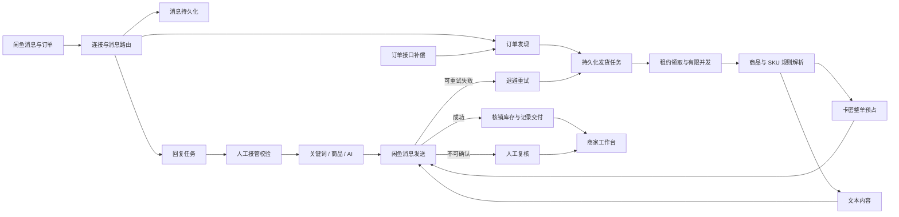

# XianYuSmart

[](https://www.oracle.com/java/technologies/downloads/#java21)
[](https://spring.io/projects/spring-boot)
[](https://vuejs.org/)
[](https://www.mysql.com/)
[](LICENSE)

面向单商家私有部署的闲鱼虚拟商品经营系统，聚焦卡密库存、自动交付、客服自动化和异常待办，在有限服务器资源下保持可恢复、可追踪、易运维。

当前版本：`1.0.0`

[核心价值](#核心价值) · [能力范围](#能力范围) · [业务流程](#业务流程) · [镜像部署](#镜像部署) · [快速启动](#快速启动) · [配置说明](#配置说明) · [开发构建](#开发构建) · [日常运维](#日常运维)

## 核心价值

| 经营问题 | 处理方式 |
| --- | --- |
| 卡密重复发送、少发或超卖 | MySQL 行级锁、整单预占、发送成功后核销、失败释放或转人工复核 |
| 服务重启后订单或回复丢失 | 发货任务与回复任务持久化，租约超时后自动恢复 |
| 多入口同时触发重复发货 | 订单号幂等入队，WebSocket 与接口发现统一进入任务队列 |
| 消息高峰占用失控 | 共用有界线程池、有限队列、批量领取和连接池上限 |
| 客服自动化误回复 | 人工接管状态持久化，关键词、商品回复和 AI 回复按结果统一判定 |
| 库存与失败情况发现太晚 | 首页集中显示可用卡密、低库存、待处理、需复核和失败任务 |
| 私有部署凭据泄露 | JWT 强密钥、会话摘要存储、密码变更全量失效、备份排除敏感字段 |
| 公网访问边界不清晰 | 应用仅绑定本机端口，Nginx 提供 HTTPS、限流和反向代理 |

## 能力范围

| 经营自动化 | 可靠交付 | 私有运维 |
| --- | --- | --- |
| 账号、Cookie、连接与掉线提醒 | 多数量卡密原子预占与幂等交付 | MySQL 自动建表和版本迁移 |
| 商品、SKU、发货规则与卡密仓库 | 发货任务重试、租约恢复与人工复核 | Docker Compose、健康检查与 HTTPS 代理 |
| 文本、卡密和多数量商品自动发货 | 人工接管与延迟回复恢复 | 业务数据备份与操作日志 |
| 关键词、商品配置与 AI 自动回复 | 消息、订单和发货结果全程留痕 | 默认排除 Cookie、API Key、邮箱密码等敏感值 |
| 收入、交付、回复、库存与异常工作台 | 失败任务集中待办 | 有界线程池、连接池与批量调度参数 |

## 业务流程



### 发货状态

`PENDING -> PROCESSING -> SUCCESS`

- 临时网络或接口失败：`PROCESSING -> RETRY -> PENDING`
- 超过重试上限或发送结果不确定：`PROCESSING -> REVIEW_REQUIRED`
- 进程异常退出：租约过期后重新领取

### 卡密状态

`AVAILABLE -> RESERVED -> USED`

- 只有库存数量完整满足订单数量时才会预占。
- 消息确认发送成功后才会核销为 `USED`。
- 明确发送失败时释放为 `AVAILABLE`。
- 发送结果无法确认时保留关联并进入人工复核，避免重复发送。

## 技术基线

- Java 21
- Spring Boot 3.5
- MySQL 5.7+
- Flyway
- MyBatis-Plus
- Vue 3、TypeScript、Vite
- Docker Compose
- Nginx

## 镜像部署

每个正式 Release 会自动发布 `linux/amd64` 镜像到 GitHub Container Registry。固定版本适合生产部署，`latest` 适合体验最新正式版本。

```bash
docker pull ghcr.io/evvvvvvvan/xianyusmart:v1.0.0
docker pull ghcr.io/evvvvvvvan/xianyusmart:latest
```

使用仓库内的 Docker Compose 启动固定版本：

Linux：

```bash
cp .env.example .env
# 修改 .env 中的数据库密码和 JWT 强密钥
export APP_IMAGE=ghcr.io/evvvvvvvan/xianyusmart:v1.0.0
docker compose pull app
docker compose up -d --no-build
```

Windows PowerShell：

```powershell
Copy-Item .env.example .env
notepad .env
$env:APP_IMAGE = 'ghcr.io/evvvvvvvan/xianyusmart:v1.0.0'
docker compose pull app
docker compose up -d --no-build
```

镜像启动仍依赖 `.env` 中的 MySQL、JWT 和跨域配置。Windows Docker Desktop 需要使用 Linux 容器模式。生产环境建议固定版本标签，避免 `latest` 更新带来未计划的版本变化。

## 快速启动

### 环境要求

- Docker Engine 24+ 或 Docker Desktop
- Docker Compose v2
- Linux 生产环境建议 2 核、2 GB 内存起步
- Windows 可使用 Docker Desktop 完成功能测试

### Linux

```bash
chmod +x install.sh
./install.sh
```

### Windows PowerShell

```powershell
Copy-Item .env.example .env
notepad .env
docker compose up -d --build
docker compose ps
```

启动前必须修改 `.env` 中的三个示例密钥。`JWT_SECRET` 至少使用 32 个随机字节，数据库密码不得复用。

启动后访问：`http://localhost:12400`

全新数据库首次访问会进入管理员账号创建页，密码长度限制为 8 至 72 位。

### 公网 HTTPS

1. 将证书保存为：

```text
deploy/nginx/certs/fullchain.pem
deploy/nginx/certs/privkey.pem
```

2. 修改 `.env`：

```dotenv
ALLOWED_ORIGINS=https://shop.example.com
TRUST_PROXY=true
```

3. 启动代理配置：

```bash
docker compose --profile proxy up -d --build
```

4. 域名解析到服务器后访问 `https://shop.example.com`。

应用容器只映射 `127.0.0.1:12400`，公网流量统一经过 Nginx。生产环境不得直接开放 MySQL 和 12400 端口。

## 配置说明

复制 `.env.example` 为 `.env` 后按环境修改：

| 变量 | 说明 | 推荐值 |
| --- | --- | --- |
| `DB_NAME` | MySQL 数据库名 | `xianyusmart` |
| `DB_USERNAME` | 业务数据库账号 | 独立低权限账号 |
| `DB_PASSWORD` | 业务数据库密码 | 随机强密码 |
| `DB_ROOT_PASSWORD` | MySQL root 密码 | 与业务密码不同 |
| `JWT_SECRET` | 登录令牌签名密钥 | 48 字节以上随机值 |
| `ALLOWED_ORIGINS` | 允许访问的前端来源 | 完整 HTTPS 域名 |
| `TRUST_PROXY` | 是否信任代理头 | 仅 Nginx 部署设为 `true` |
| `UPDATE_RELEASE_API` | 自有 GitHub 发行版 API | 留空关闭，格式为 `https://api.github.com/repos/OWNER/REPO/releases/latest` |
| `DB_POOL_MAX_SIZE` | 最大数据库连接数 | 单实例默认 `10` |
| `DB_POOL_MIN_IDLE` | 最小空闲连接数 | 默认 `2` |
| `JAVA_OPTS` | JVM 容器内存策略 | 默认值适合小型私有实例 |

可在 `compose.yaml` 的 `app.environment` 中补充以下调优变量：

| 变量 | 默认值 | 作用 |
| --- | ---: | --- |
| `EXECUTOR_CORE_SIZE` | 4 | 通用业务线程数 |
| `EXECUTOR_MAX_SIZE` | 8 | 通用业务最大线程数 |
| `EXECUTOR_QUEUE_CAPACITY` | 500 | 有界任务队列容量 |
| `DELIVERY_CLAIM_BATCH_SIZE` | 20 | 单轮领取发货任务数 |
| `DELIVERY_DISPATCH_DELAY_MS` | 1000 | 发货调度间隔 |
| `DELIVERY_LEASE_SECONDS` | 120 | 任务处理租约 |
| `DELIVERY_MAX_ATTEMPTS` | 3 | 最大发货尝试次数 |
| `PRINT_RAW_MESSAGE` | false | 原始消息日志开关，生产环境保持关闭 |

调大并发前应同步评估闲鱼接口频率、MySQL 连接数和服务器内存。单商家场景优先保持默认值，通过异常待办确认实际瓶颈后再调整。

## 开发构建

### Windows 本地开发

准备 Java 21、Node.js 20+、MySQL 5.7+，然后创建数据库和账号：

```sql
CREATE DATABASE xianyusmart CHARACTER SET utf8mb4 COLLATE utf8mb4_unicode_ci;
CREATE USER 'xianyusmart'@'localhost' IDENTIFIED BY 'replace-with-strong-password';
GRANT ALL PRIVILEGES ON xianyusmart.* TO 'xianyusmart'@'localhost';
FLUSH PRIVILEGES;
```

后端：

```powershell
$env:DB_PASSWORD = 'replace-with-strong-password'
$env:JWT_SECRET = 'replace-with-at-least-32-random-bytes'
.\mvnw.cmd spring-boot:run
```

前端：

```powershell
Set-Location vue-code
npm ci
npm run dev
```

前端开发地址为 `http://localhost:5173`，接口自动代理到 `http://localhost:12400`。

## 构建与验证

```powershell
Set-Location vue-code
npm ci
npm run type-check
npm run build:spring
Set-Location ..
.\mvnw.cmd clean test
.\mvnw.cmd clean package
```

Linux 将 `mvnw.cmd` 替换为 `./mvnw`。

## 目录与职责

```text
src/main/java/com/xianyusmart/
├─ controller/          HTTP 接口与工作台聚合
├─ service/             账号、消息、回复、发货和持久化任务
├─ service/delivery/    文本与卡密交付策略
├─ websocket/           闲鱼长连接、路由和重连
├─ mapper/              MySQL 数据访问与任务锁定
├─ interceptor/         登录认证边界
├─ backup/              可选择的数据备份
└─ config/              线程池、Web、数据库与 AI 配置

src/main/resources/
├─ db/migration/        Flyway 数据库结构
├─ static/              已构建的 Vue 前端
└─ application.yaml     运行参数

vue-code/src/
├─ api/                 前端接口封装
├─ components/          共用组件与布局
├─ views/               商家业务页面
├─ utils/               请求、提示与确认工具
└─ assets/              简约商业主题

deploy/nginx/            HTTPS、限流和反向代理
compose.yaml             应用、MySQL、Nginx 编排
```

## 日常运维

查看状态与日志：

```bash
docker compose ps
docker compose logs -f --tail=200 app
docker compose logs -f --tail=200 mysql
```

更新本地代码后：

```bash
docker compose up -d --build
```

备份 MySQL：

```bash
docker compose exec mysql mysqldump -uxianyusmart -p xianyusmart > xianyusmart.sql
```

恢复前应先停止应用写入并验证备份文件。业务数据导出不包含 Cookie、AI Key、邮箱密码等敏感配置，灾备流程需单独保存运行环境变量和证书。

## 使用边界

- 闲鱼接口、Cookie 和风控策略可能变化，账号状态与异常待办需要持续关注。
- 自动化频率应符合平台规则，不应用于欺诈、骚扰或绕过平台安全机制。
- 公网部署必须启用 HTTPS、强密码、主机防火墙和定期备份。
- 全新环境使用 MySQL，不提供 SQLite 历史数据自动迁移。

## 许可证

本项目遵循仓库中的 [Apache License 2.0](LICENSE)。
